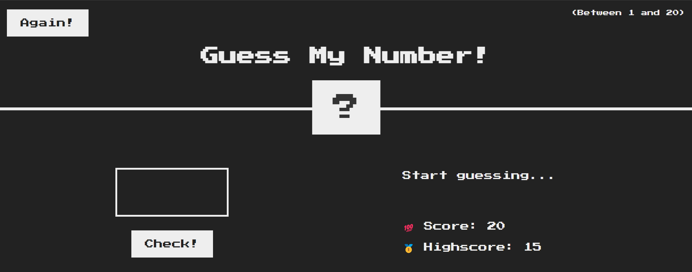

# -Guess-my-number-Game
My first ever game created using JavaScript.
This is my first step into programming world. Following the Udemy Course "The complete JavaScript Course; from zero to Expert!", the game "Guess my number!" will challenge you to guess a secret number between 1 to 20. You have a Score and also the game keeps your highest score (Highscore). You have 20 chances to guess before you lost the game, and of course, you can play it again (Again!). 
Personal thoughts: I was never a gamer girl, but now I discovered I like to create them! 

[[[Link to Udemy Course] ](https://www.udemy.com/course/the-complete-javascript-course/?couponCode=KEEPLEARNING)

Screenshots: 
Here are some screenshots to see features of my project. 

